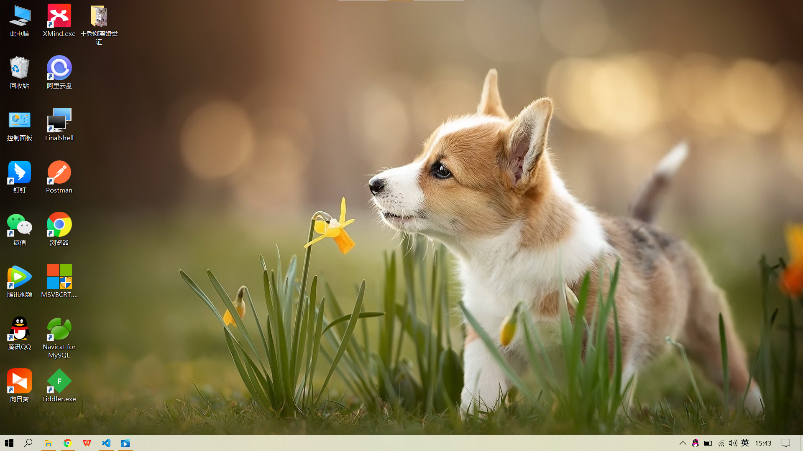

# vscode的学习和应用
## python
python的后缀名是.dy
```py
print("hello world!")
```
## markdown
markdown是当前流行的一种用来写文章的语言。
可以快捷地生成漂亮的排版和格式。
“#代表是以及标题”
“##代表二级标题”
“----”代表分割线
## MYSQL

## 流程图
流程图的文件后缀名是.dio
## 图片
粘贴的快捷键是 CTRL + alt + v
就可以把复制的图片直接粘贴过来
配合截图使用很棒！
设置图片保存的位置，如图
 

## git的配置
注册github
安装git 
VScode 的设置里弄好git 的路径
在git bash 里做好设置
同步GitHub